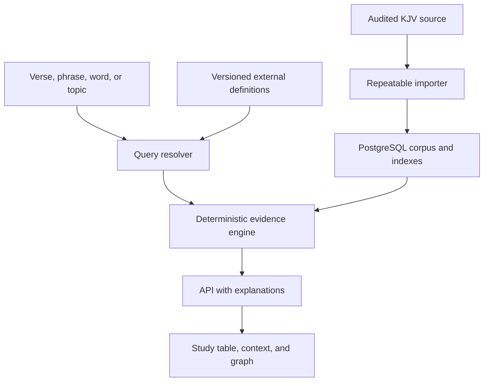

# Architecture

## System shape

External definitions participate only in topic resolution. They never enter the ranking formula.

## Components

### Corpus importer

Downloads or accepts a pinned source file, verifies its checksum, parses canonical references and text, emits an import report, populates database tables, and fails closed on anomalies.

### Search package

Pure TypeScript functions for tokenization, normalization, IDF, occurrence lookup, candidate generation, scoring, tie-breaking, first/last mention, comparison, and explanation records. Database adapters feed data into these functions; they do not redefine scoring.

### Web application

Next.js pages and route handlers. Server code validates queries, executes repository/search services, and returns versioned response schemas. Client code renders tables, context, filters, and graphs.

### Topic resolver

Server-only adapter to approved dictionary sources. It caches source responses, requires sense selection, intersects synonyms with corpus vocabulary, and produces a provenance-rich bridge record.

### Optional explanation service

May turn an existing evidence record into prose. It receives only retrieved passages and structured explanations. Its output is labeled generated, includes passage references, and cannot write to indexes or scores.

## Operational modes

- Offline core: corpus import from a local file, exact search, similarity ranking, graph, exports.
- Connected expansion: dictionary lookup for absent modern terms.
- Optional generated summary: disabled by default and never required for a complete result.

## Security and privacy

- Validate all inputs and cap query lengths, range sizes, graph nodes, and result counts.
- Use parameterized SQL.
- Keep provider keys server-side.
- Apply rate limits to external lookup and generated-summary endpoints.
- Sanitize imported labels and user notes before rendering.
- Do not log full private study notes or secret values.

## Performance targets for MVP

- Exact reference or word query: p95 under 300 ms on a warm local database.
- Similar-verse query over the full corpus: p95 under 1 second, default top 50.
- Initial graph rendering: at most 100 nodes; larger sets require user expansion.
- Import: repeatable and memory-bounded; speed is secondary to validation.

## Reproducibility

Every response includes corpus version, algorithm version, configuration hash, and query normalization trace. An exported research record must contain enough information to re-run the query, excluding copyrighted source text beyond what the project is permitted to redistribute.

