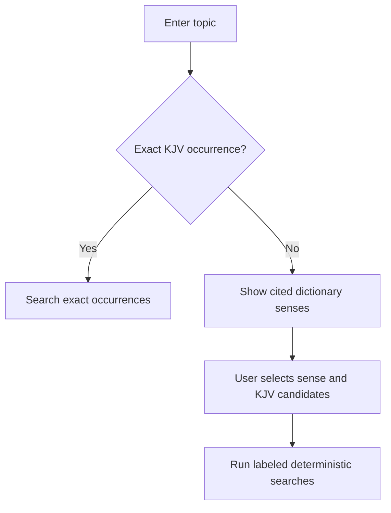

# Interface Specification

## Design goal

Make the evidence legible before making it impressive. Tables are primary; the graph is a complementary view. The interface should feel like a concordance workbench, with dense information, strong hierarchy, and minimal decoration.

## Main study page

1. Search field with explicit modes: Reference, Exact word, Exact phrase, Related verses, Topic.
2. Query interpretation strip showing exactly how the input was parsed.
3. Source passage with preceding/following context controls.
4. Evidence summary: counts, significant terms, longest shared phrases, first/last mention.
5. Results table with reference, exact text excerpt, total score, component bars, and “Why” disclosure.
6. Filters for book, testament, minimum score, evidence type, and excluded terms.
7. Table/graph toggle.
8. Export control.

## Explanation disclosure

For each result, show:

- shared surface words;
- normalized matches with their rules;
- exact phrase spans;
- rare-word frequencies;
- word-order alignment;
- editorial cross-reference source, if present;
- external topic bridge, if present;
- formula values and tie-break position.

Do not replace this with generic prose.

## Topic-resolution flow

The user must be able to cancel expansion and retain the meaningful result “not found exactly.”

## Evidence graph

- Verse nodes and term nodes use different shapes, not color alone.
- Edge style identifies exact phrase, word, normalized alias, editorial cross-reference, or external bridge.
- Selecting an edge opens its full explanation.
- Default to a small top-ranked graph; expansion is deliberate.
- Provide the same information in an accessible table.

## Accessibility

- Meet WCAG 2.2 AA for contrast, focus visibility, keyboard navigation, labels, and error handling.
- Never encode evidence type or score only by color.
- Make graph navigation optional; all tasks must be possible without it.
- Announce search completion and result counts to assistive technology.
- Respect reduced motion.
- Use semantic tables for ranked results.

## Required notices

Place concise notices near relevant controls:

- Similarity is lexical evidence, not proof of interpretation.
- Normalized words are derived and the exact KJV wording remains visible.
- Topic expansion uses an external dictionary and requires user judgment.
- Editorial cross-references are not part of the KJV text.

